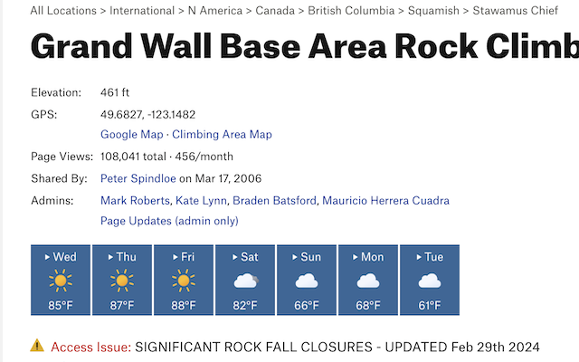
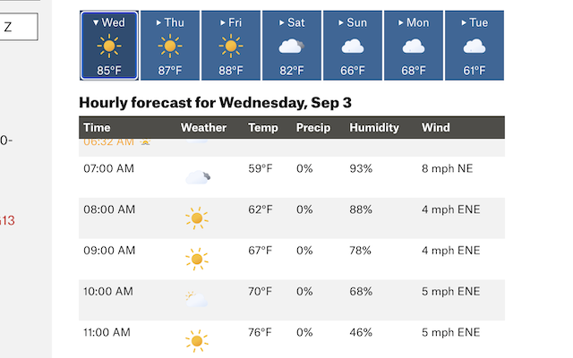

#  Mountain Project Weather Enhanced

Chrome extension that replaces the weather forecast panel on Mountain Project (MP) area pages for more coverage, detail, and reliability. 



The default forecast panel on MP does not work for any areas under the "International" area umbrella. Additionally, even for supported areas in the United States, the forecast may show up as unavailable. This extension uses the FOSS [Open-Meteo](https://open-meteo.com/) API instead, which allows for global forecasting and may increase reliability even in areas that were already covered by MP.

The daily forecasts also offer on-click expanision into an hourly forecast with the various metrics that are most relevant to planning a day of climbing.



All animated weather icons are from https://github.com/basmilius/weather-icons/.

## Installation

For general usage, the easiest way to add the extension to your Chrome browser is from the [extension page](https://chromewebstore.google.com/detail/jjcnagbiidbmijfogifohnaaamemdblm?utm_source=item-share-cb).

For local development and testing, clone the repository and run:

```
npm install
npx vite build
```

After the project is built, [add it manually](https://developer.chrome.com/docs/extensions/get-started/tutorial/hello-world#load-unpacked) to Chrome.
